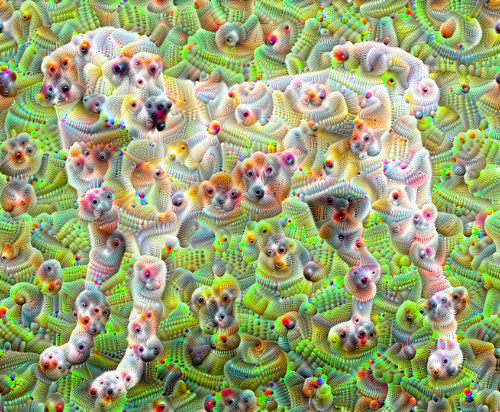

# 🌀 Deep Dream Generator with PyTorch

[](https://pytorch.org/)
[](https://streamlit.io/)
[](https://mlflow.org/)

A PyTorch implementation of Google's Deep Dream algorithm using VGG-16 for psychedelic image generation, featuring an interactive web interface.

 

## 🧠 Key Concepts

##### 🌌 What is Deep Dream?
Deep Dream is a computer vision technique that amplifies patterns learned by neural networks, creating surreal, dream-like images by maximizing activation gradients.

 

##### 🚀 Why PyTorch?
1. Dynamic Computation Graph: Flexible gradient manipulation
2. Pretrained Models: Easy access to VGG-16
3. GPU Acceleration: CUDA support for faster processing

##### 🏛️ VGG-16 Architecture
The 16-layer CNN from Oxford's Visual Geometry Group, known for its simplicity and effectiveness in feature extraction.

 

##### ⬆️ Gradient Ascent
Unlike gradient descent for loss minimization, we maximize layer activations through:

```python
for _ in range(steps):
    optimizer.zero_grad()
    loss = features.norm()  # Maximize activation
    loss.backward()
    optimizer.step()
```

## 🛠️ Project Structure

```plaintext
deep-dream-pytorch/
├── app.py               # Streamlit web interface
├── requirements.txt     # Dependencies
├── images/              # Sample images and diagrams
├── README.md            # This documentation
└── mlruns/              # MLflow experiment tracking
```

## ⚙️ Installation

##### 1️⃣ Clone repository:
```bash
git clone https://github.com/yourusername/deep-dream-pytorch.git
cd deep-dream-pytorch
```

##### 2️⃣ Install dependencies:
```bash
pip install -r requirements.txt
```
##### 3️⃣ Run Streamlit app:
```bash
streamlit run main.py
```

## 🎮 How It Works: Step-by-Step

##### 1️⃣ Image Upload
1. Upload any JPG/PNG image
2. Adjust intensity (1-10) for effect strength

##### 2️⃣ Processing Pipeline
1. Preprocessing
```plaintext
Resize → Normalize → Tensor Conversion
```
2. Feature Extraction
```python
model = models.vgg16(weights=True).features[:23]  # First 23 layers
```
3. Gradient Ascent
```plaintext
20 optimization steps with **ADAM** optimizer
```
4. Postprocessing
```plaintext
Denormalize → Clamp → Convert to PIL Image
```

##### 3️⃣ Results Display
